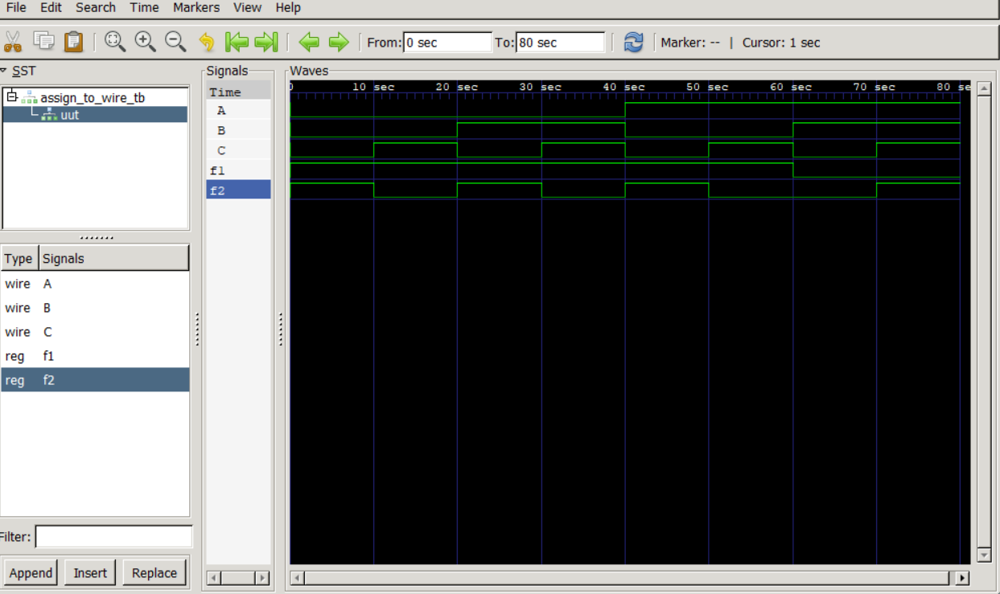

# Assigning to a Wire in Verilog

## Objective

Understand how combinational logic is implemented using an `always` block.

---

## Design Description

The circuit performs:

f1 = ~(A & B)
f2 = f1 ^ C

Where:

- `f1` is generated using a NAND operation.
- `f2` is generated using an XOR operation.

---

## RTL Code

```verilog
f1 = ~(A & B);
f2 = f1 ^ C;
```

## Hardware Generated

The synthesizer generates:

- NAND Gate
- XOR Gate

No storage elements are inferred.

---

## Result 

Test case 1: A=0, B=0, C=0 => f1=1, f2=1
Test case 2: A=0, B=0, C=1 => f1=1, f2=0
Test case 3: A=0, B=1, C=0 => f1=1, f2=1
Test case 4: A=0, B=1, C=1 => f1=1, f2=0
Test case 5: A=1, B=0, C=0 => f1=1, f2=1
Test case 6: A=1, B=0, C=1 => f1=1, f2=0
Test case 7: A=1, B=1, C=0 => f1=0, f2=0
Test case 8: A=1, B=1, C=1 => f1=0, f2=1

---

## Simulation Waveform



---

## Key Learning

- Difference between wire and reg
- Combinational logic modeling
- Hardware inference
- NAND and XOR implementation
- RTL design fundamentals