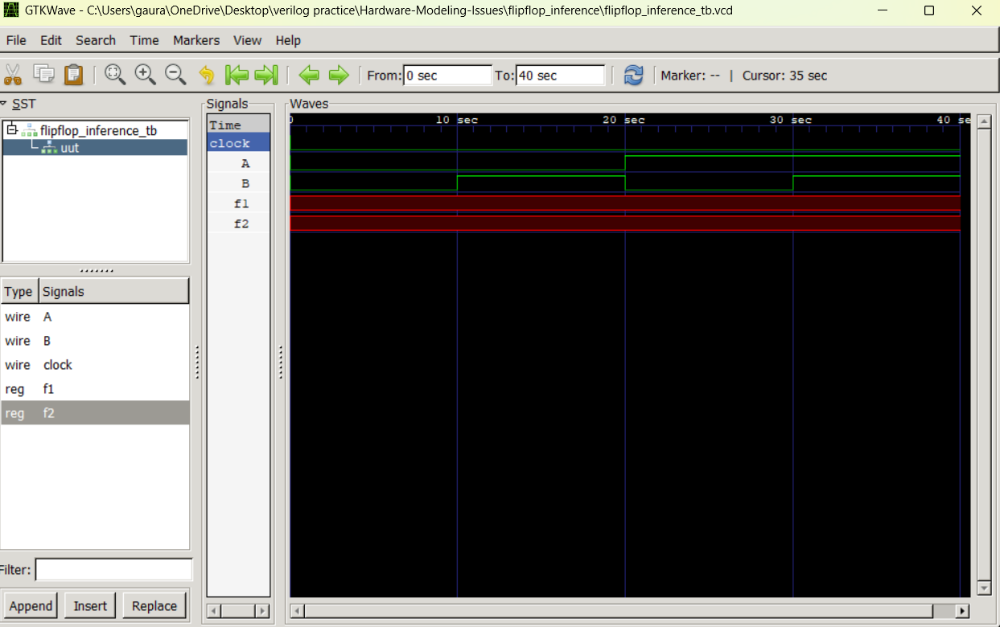

# Flip-Flop Inference in Verilog

## Objective

Understand how clocked procedural blocks infer flip-flops during synthesis.

---

## Design Description

The design updates outputs only on the rising edge of the clock.

```verilog
always @(posedge clk)
begin
    f2 <= f1 ^ f2;
    f1 <= ~(A & B);
end
```

---

## Hardware Generated

The synthesizer infers:

- D Flip-Flop for f1
- D Flip-Flop for f2
- NAND logic
- XOR logic

---

## Why Flip-Flops Are Generated

Because the logic is inside:

```verilog
always @(posedge clk)
```

the outputs must store values between clock edges.

Storage elements are therefore required.

---

## Signal Behavior

### f1

```verilog
f1 <= ~(A & B);
```

Stores the NAND result on every rising clock edge.

### f2

```verilog
f2 <= f1 ^ f2;
```

Uses the previous value of f2 and current value of f1.

This requires memory and results in flip-flop inference.

---

## Simulation Waveform



---

## Key Learning

- Sequential logic design
- Edge-triggered storage
- Flip-flop inference
- Non-blocking assignments
- Hardware synthesis behavior
