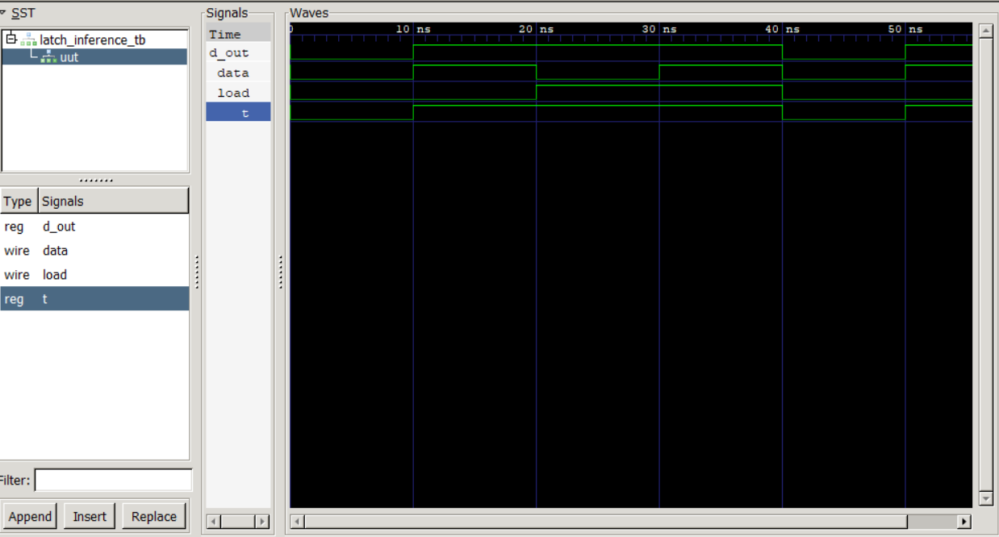

# Latch Inference in Verilog

## Objective

This project demonstrates how a level-sensitive latch can be inferred during synthesis when a signal must retain its previous value.

---

## RTL Design

### latch_inference.v

```verilog
module latch_inference (
    input data,
    input load,
    output reg d_out
);

reg t;

always @(load or data)
begin
    if (!load)
        t = data;

    d_out = t;
end

endmodule
```

---

## Description

The latch operates as follows:

### When load = 0

- Latch is transparent (open)
- Input data passes directly to output

```text
d_out = data
```

### When load = 1

- No assignment is made to t
- Previous value must be retained

```text
d_out holds previous value
```

Because the previous value must be remembered, synthesis infers a level-sensitive latch.

---

## Hardware Inferred

- Level-Sensitive Latch
- Storage Element

---

## Truth Table

| Load | Data | Output |
|--------|--------|--------|
| 0 | 0 | 0 |
| 0 | 1 | 1 |
| 1 | X | Holds Previous Value |

---

## Simulation

### Compile

```bash
iverilog -o latch.out latch_inference.v latch_inference_tb.v
```

### Run

```bash
vvp latch.out
```

### View Waveform

```bash
gtkwave latch_inference.vcd
```

---

## Waveform



---

## Key Learning

- Latch Inference
- Level-Sensitive Storage
- Incomplete Assignments
- Verilog Hardware Modeling
- Synthesis Behavior

---

## Tools Used

- Verilog HDL
- Icarus Verilog
- GTKWave
- VS Code