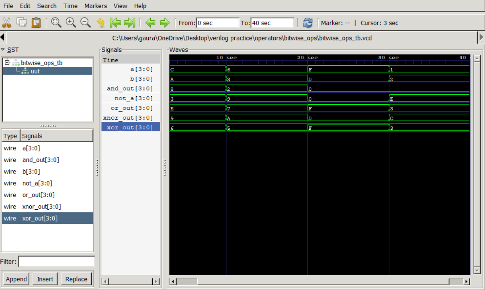

# Bitwise Operators in Verilog

A Verilog HDL implementation of fundamental **bitwise operators** using a combinational design module and a dedicated testbench. The project demonstrates bit-level operations on 4-bit inputs and verifies their functionality through simulation using **Icarus Verilog** and **GTKWave**.

## Features

* Bitwise NOT (`~`)
* Bitwise AND (`&`)
* Bitwise OR (`|`)
* Bitwise XOR (`^`)
* Bitwise XNOR (`~^`)
* Separate design and testbench modules
* GTKWave waveform verification

## Project Structure

```text
bitwise_ops/
├── bitwise_ops.v
├── bitwise_ops_tb.v
├── waveform.png
└── README.md
```

## Simulation

Compile the design and testbench:

```bash
iverilog -o wave.out bitwise_ops.v bitwise_ops_tb.v
```

Run the simulation:

```bash
vvp wave.out
```

View the waveform:

```bash
gtkwave bitwise_ops.vcd
```

## Waveform


