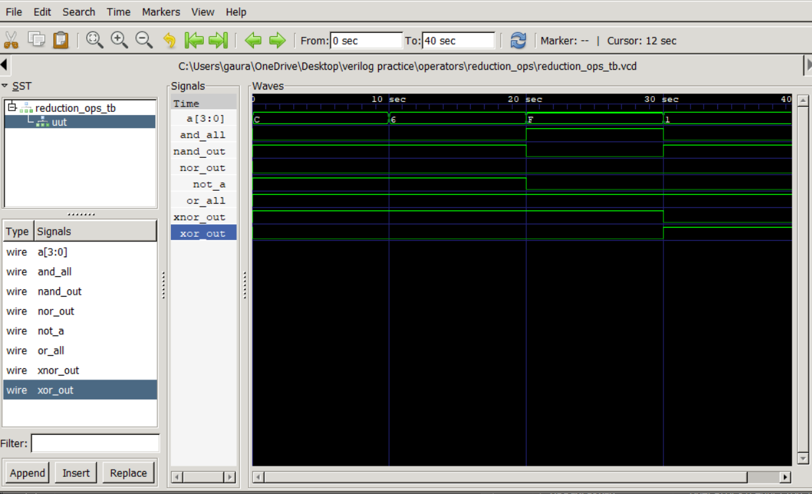

# Reduction Operators in Verilog

This project demonstrates the implementation of **reduction operators** in Verilog using a combinational design module and a dedicated testbench. The design applies reduction operations to a 4-bit input and verifies the outputs through simulation using **Icarus Verilog** and **GTKWave**.

## Features

* Reduction AND (`&`)
* Reduction NAND (`~&`)
* Reduction OR (`|`)
* Reduction NOR (`~|`)
* Reduction XOR (`^`)
* Reduction XNOR (`~^`)
* Separate design and testbench modules
* GTKWave waveform verification

## Project Structure

```text
reduction_ops/
├── reduction_ops.v
├── reduction_ops_tb.v
├── waveform.png
└── README.md
```

## Simulation

```bash
iverilog -o wave.out reduction_ops.v reduction_ops_tb.v
vvp wave.out
gtkwave reduction_ops_tb.vcd
```

## Waveform


