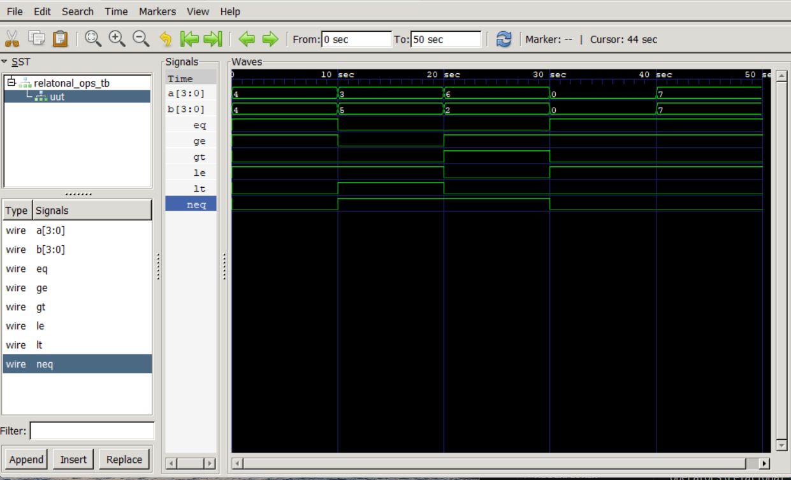

# Relational Operators in Verilog

This project demonstrates the implementation of **Relational Operators** in Verilog HDL. The design compares two 4-bit input values and produces six comparison outputs using continuous assignment statements (`assign`). A dedicated testbench verifies the functionality with multiple test cases, and the results are observed using GTKWave.

---

## 📌 Objective

- Understand relational operators in Verilog.
- Compare two 4-bit numbers.
- Simulate the design using Icarus Verilog.
- Verify the outputs using GTKWave.

---

## 📂 Project Structure

```
relational_ops/
│── relational_ops.v          # Design Module
│── relational_ops_tb.v       # Testbench
│── relational_ops.vcd        # Generated Waveform
│── waveform.png              # GTKWave Screenshot
└── README.md
```

---

## 🛠️ Design Module

The design compares two 4-bit inputs using Verilog relational operators.

### Inputs

| Signal | Width | Description |
|---------|------:|-------------|
| a | 4-bit | First input |
| b | 4-bit | Second input |

### Outputs

| Signal | Description |
|---------|-------------|
| eq | a == b |
| neq | a != b |
| gt | a > b |
| lt | a < b |
| ge | a >= b |
| le | a <= b |

---

## ⚙️ Relational Operators Used

| Operator | Description |
|----------|-------------|
| `==` | Equal To |
| `!=` | Not Equal To |
| `>` | Greater Than |
| `<` | Less Than |
| `>=` | Greater Than or Equal To |
| `<=` | Less Than or Equal To |

---

## 🧪 Test Cases

| Test Case | a | b | Expected Result |
|-----------|--:|--:|----------------|
| 1 | 4 | 4 | Equal |
| 2 | 3 | 5 | Less Than |
| 3 | 6 | 2 | Greater Than |
| 4 | 0 | 0 | Equal |
| 5 | 7 | 7 | Equal |

---

## ▶️ Simulation

### Compile

```bash
iverilog -o wave.out relational_ops.v relational_ops_tb.v
```

### Run

```bash
vvp wave.out
```

### Open Waveform

```bash
gtkwave relational_ops.vcd
```

---

## 📊 Expected Output

```
----------------------------------------------
 a   b   ==  !=   >   <   >=  <=
----------------------------------------------
 4   4    1   0    0   0    1   1
 3   5    0   1    0   1    0   1
 6   2    0   1    1   0    1   0
 0   0    1   0    0   0    1   1
 7   7    1   0    0   0    1   1
----------------------------------------------
```

---

## 🌊 Waveform

The simulation waveform verifies the correct behavior of all relational operators.

Add your GTKWave screenshot here after saving it as **waveform.png**.

```markdown
## Waveform Output


```

---

## 📚 Concepts Covered

- Verilog HDL
- Relational Operators
- Continuous Assignment (`assign`)
- Combinational Logic
- Testbench Development
- Digital Comparators
- Simulation using Icarus Verilog
- Waveform Analysis using GTKWave

---

## 🧰 Tools Used

- Verilog HDL
- Visual Studio Code
- Icarus Verilog
- GTKWave
- Git & GitHub

---

## 🎯 Learning Outcomes

After completing this project, you will be able to:

- Implement relational operators in Verilog.
- Design combinational comparison circuits.
- Write a Verilog testbench.
- Compile and simulate Verilog code.
- Analyze digital waveforms using GTKWave.
- Organize Verilog projects for GitHub.

---

## 👨‍💻 Author

**Gaurav**

B.Tech – Electronics and Communication Engineering (ECE)

National Institute of Technology (NIT) Hamirpur

---
