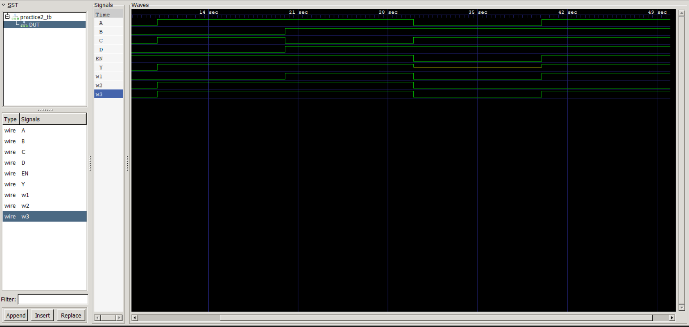

# Practice 2

## Objective
Implementation of a gate-level circuit using AND, XOR, OR, and Tri-State Buffer.

## Logic Function

Y = ((A AND B) OR (C XOR D)) when EN = 1

## Files

- practice2.v → Design module
- practice2_tb.v → Testbench

## Simulation Waveform

